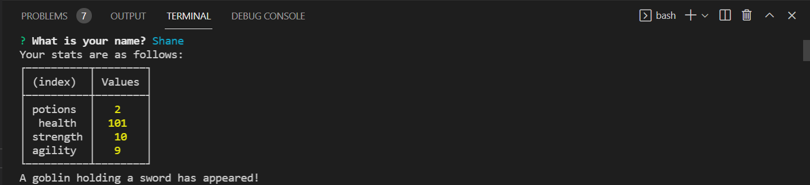

# Jest-Another-RPG

# Description

In this module, I created a command-line role-playing game (RPG) in which the user battles a series of enemies whose health and stats can be sustained by taking a potion. My game will create new objects using JavaScript constructor functions, and also implement basic code tests using the Jest framework.



# Pre-requisites

- Install [Node.js](https://nodejs.org/en/) version 8.0.0

# Getting started

- Clone the repository

```
git clone <git@github.com:shanebramble/jest-another-RPG.git> 
```

- Install dependencies

```
cd <project_name>
npm install
```

- Build and run the project

```
npm start
```

### Built With

- JavaScipt
- Node.js

## Contribution

Made with ❤️ by Shane Bramble-Wade

### ©️2021 Jest-Another-RPG, Inc
